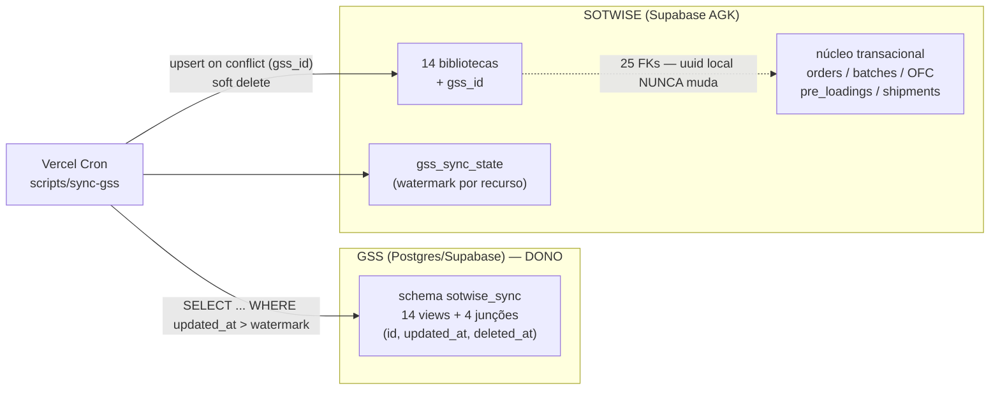

# Interligação SOTWISE ← GSS — bibliotecas

Especificação da sincronização das **14 bibliotecas** (cadastros de referência)
entre o banco externo **GSS** e o banco do SOTWISE.

Complementa [`docs/SCHEMA.md`](SCHEMA.md) (schema do nosso lado) e
[`docs/API.md`](API.md) (a API REST atual, que esta decisão torna obsoleta — §7).

> ⚠️ **Revisado pelo ERD do GSS** (recebido em 2026-08-11 — ver
> [`docs/MAPEAMENTO_GSS.md`](MAPEAMENTO_GSS.md)). O schema real deles contradiz
> três premissas do contrato abaixo: **não existe `deleted_at`** em modelo nenhum
> (§3.2), a **PK é inteira, não uuid** (o que inviabiliza o caminho A do §5 como
> estava escrito), e **`Supplier` — fonte das nossas `factories` — não tem
> `updated_at`** (§4.4). O mapeamento traz os substitutos. A arquitetura (pull,
> GSS como dono, `gss_id` como pareamento) segue válida.

---

## 1. Decisões que definem o desenho

| Questão | Decisão |
|---|---|
| **O que é o GSS** | Postgres / Supabase. Dá para ler direto — sem depender de API intermediária. |
| **Quem é o dono das bibliotecas** | **O GSS.** Ele passa a ser o único lugar onde biblioteca é criada ou editada. |
| **Papel do SOTWISE** | **Consumidor read-only.** Nada de biblioteca nasce ou muda aqui. |
| **Quem inicia o sync** | **Nós.** Pull agendado: um job nosso lê o GSS e aplica localmente. |

Consequências diretas:

- **Não existe conflito de escrita.** Não há last-write-wins, não há merge de
  campo — o GSS sempre ganha, porque só ele escreve.
- **O GSS não precisa implementar nada além de *deixar ler*** (§3). Nenhuma
  chamada sai do GSS na nossa direção.
- **As telas de Registration viram somente-leitura** e a API `POST /api/*`
  perde a razão de existir (§7).

### 1.1 As 14 bibliotecas

`countries` · `cities` · `pols` · `pods` · `factories` · `categories` ·
`contacts` · `agents` · `carriers` · `clients` · `exporters` ·
`business_units` · `order_types` · `shipment_models`

Mais as **4 junções** entre elas, que também são dado de biblioteca e precisam
vir do GSS: `city_pols`, `category_factories`, `agent_contacts`,
`carrier_agents`.

---

## 2. Arquitetura



**A invariante que sustenta tudo:** o `uuid` local de cada biblioteca é
imutável. 25 FKs do núcleo transacional apontam para ele, sobre 9.495 linhas de
`order_factory_category`, 3.144 lotes e 1.389 pre-loadings
([SCHEMA §3.3](SCHEMA.md#33-quem-aponta-para-as-bibliotecas)). O id do GSS entra
numa coluna **paralela** (`gss_id`), nunca como PK.

Por isso o pull nunca faz `delete`: só `deleted_at`. Apagar uma `factory` de
verdade derrubaria linhas de `order_factory_category` — ou seria travado pela FK,
que não tem cláusula `on delete`.

---

## 3. Contrato que o GSS precisa cumprir

O que pedimos do lado do GSS é modesto: **expor leitura estável**. Recomendação
concreta, já que é Postgres:

### 3.1 Acesso

Criar um **schema `sotwise_sync`** com uma view por recurso e um **role
read-only** dedicado:

```sql
-- no GSS
create role sotwise_reader login password '<forte>' noinherit;
create schema if not exists sotwise_sync;
grant usage on schema sotwise_sync to sotwise_reader;
grant select on all tables in schema sotwise_sync to sotwise_reader;
alter default privileges in schema sotwise_sync
  grant select on tables to sotwise_reader;
```

Views em vez de acesso às tabelas cruas: o GSS fica livre para refatorar por
dentro sem quebrar o nosso puller, e nós vemos só as colunas do contrato.

Conexão: string do **pooler** do Supabase do GSS (porta 6543, modo transaction).
Se preferirem PostREST em vez de conexão direta, serve igual — basta expor o
schema `sotwise_sync` na API e nos dar uma chave; o contrato de colunas é o
mesmo. **Não** queremos a `service_role` do GSS: privilégio a mais sem uso.

### 3.2 Colunas obrigatórias em toda view

| Coluna | Tipo | Regra |
|---|---|---|
| `id` | uuid ou text | **Estável e imutável.** É o que gravamos em `gss_id`. Se mudar, o registro é tratado como novo e duplica. |
| `name` | text not null | Nome canônico exibido. |
| `updated_at` | timestamptz not null | Atualizado **em toda** alteração, por trigger. É o cursor do sync incremental — se não subir, a mudança nunca chega aqui. |
| `deleted_at` | timestamptz | Soft delete. **O GSS não deve apagar linha de biblioteca** — se apagar, o registro simplesmente para de aparecer no pull e nós nunca sabemos que ele saiu. |

⚠️ **Alteração de vínculo também precisa mexer no `updated_at` do pai.** Se
alguém troca as fábricas de uma categoria sem que `categories.updated_at` suba, o
pull incremental não vê nada e a junção fica velha. Vale para as 4 junções.

### 3.3 Colunas por recurso

Além de `id`, `name`, `updated_at`, `deleted_at`:

| View | Colunas extras | Observação |
|---|---|---|
| `countries` | — | |
| `cities` | — | |
| `pols` | — | |
| `pods` | — | |
| `factories` | — | 752 linhas hoje do nosso lado |
| `categories` | — | exige ≥ 1 fábrica vinculada |
| `carriers` | — | |
| `shipment_models` | — | |
| `clients` | `country_id` | id **do GSS** de um country; nullable |
| `exporters` | `acronym` text not null | |
| `contacts` | `email` text, `email_na` boolean, `phone_number` text | regra: ou `email` preenchido, ou `email_na = true` |
| `agents` | `country_id`, `location`, `email`, `email_na`, `phone_number` | `location` **só aceita** `brazil` ou `china` (enum local) |
| `business_units` | — | ícone **não** vem pelo sync (§6.4) |
| `order_types` | `color` text | ícone **não** vem pelo sync (§6.4) |

FKs entre bibliotecas (`clients.country_id`, `agents.country_id`) vêm como **id
do GSS**, não como uuid nosso — a tradução é nossa.

### 3.4 Junções

Uma view por junção, com os dois ids do GSS:

| View | Colunas |
|---|---|
| `city_pols` | `city_id`, `pol_id` |
| `category_factories` | `category_id`, `factory_id` |
| `agent_contacts` | `agent_id`, `contact_id` |
| `carrier_agents` | `carrier_id`, `agent_id` |

Junção não tem id próprio nem timestamp — ela é sincronizada **como conjunto**:
para cada pai que apareceu no pull, apagamos e regravamos os vínculos dele
(mesma estratégia do `syncAgentContacts` atual). Daí a exigência do §3.2 de subir
o `updated_at` do pai.

> **Cardinalidade — respondida, mas com uma reviravolta.** `category_factories` é
> **M-N** confirmado (`SupplierCategory` é junção de verdade, com `city` + `code`
> a mais). Já `city_pols`, embora modelada M-N, é usada como **1-1** nos dados:
> 74 `pols` para 23 portos reais, cada linha com uma cidade só. As nossas
> bibliotecas `pols` e `factories` **são junções desnormalizadas** — o que muda a
> granularidade do pareamento. Ver
> [MAPEAMENTO_GSS §2](MAPEAMENTO_GSS.md#2-o-que-os-dados-provam-sobre-o-glossário)
> e §6.

---

## 4. Do nosso lado

### 4.1 `gss_id` (migration já escrita, **não aplicada**)

`supabase/migrations/20260803120000_add_gss_id_to_libraries.sql` adiciona
`gss_id text unique` nas 14 bibliotecas. Verificado em 2026-08-11: **não está em
produção** (`column countries.gss_id does not exist`). É o primeiro passo
executável.

`unique` simples (não parcial) permite vários `null` — registros ainda não
pareados — e habilita `on conflict (gss_id)`.

### 4.2 Watermark do sync

```sql
create table public.gss_sync_state (
  resource      text primary key,        -- 'countries', 'agents', …
  watermark     timestamptz,             -- maior updated_at já processado (do relógio do GSS)
  last_run_at   timestamptz,
  last_status   text,                    -- 'ok' | 'error'
  last_error    text,
  rows_upserted integer not null default 0,
  rows_deleted  integer not null default 0
);
```

### 4.3 Ordem obrigatória do pull

FK entre bibliotecas manda a ordem:

```
1. countries
2. contacts · factories · categories · cities · pols · pods · carriers ·
   exporters · business_units · order_types · shipment_models   (independentes)
3. clients · agents                    (precisam de countries)
4. city_pols · category_factories · agent_contacts · carrier_agents  (junções)
```

### 4.4 Algoritmo

Por recurso, em ordem:

1. `select * from sotwise_sync.<recurso> where updated_at > watermark - interval '5 minutes' order by updated_at` — a **sobreposição de 5 min** cobre desvio de relógio e transações que commitaram fora de ordem. O upsert é idempotente, reprocessar não custa nada.
2. Traduzir FK: `country_id` do GSS → uuid local, via `gss_id`. Não achou → registra pendência e deixa `null` (não inventa).
3. `insert … on conflict (gss_id) do update set …` — atualiza `name` e os campos do recurso. **Nunca** toca em `id`, `created_at`, `created_by` nem `bubble_id`.
4. Linha com `deleted_at` no GSS → grava `deleted_at` local. Se voltar a `null` lá (restaurada), limpa aqui.
5. Avança o watermark para o **maior `updated_at` lido**, e não para `now()` nosso — o relógio de referência é o do GSS.
6. Grava o resultado em `gss_sync_state` e loga contagens.

Modo **`--dry-run`** obrigatório: imprime o que faria sem escrever. É como a
primeira execução vai ser validada.

### 4.5 Agendamento

Vercel Cron chamando uma rota protegida (`CRON_SECRET`), ou o job rodando como
script. **Confirmar a frequência que o plano da Vercel permite** antes de
prometer intervalo curto — em plano Hobby o cron é diário. Se precisar de minutos,
ou o projeto sobe de plano, ou o agendador vai para outro lugar (pg_cron no nosso
Supabase, GitHub Actions).

---

## 5. O pareamento inicial — o ponto crítico

Hoje as bibliotecas locais têm **1.510 linhas** vindas do Bubble, todas em uso
pelo transacional:

| | | | |
|---|---:|---|---:|
| factories | 752 | clients | 115 |
| contacts | 288 | cities | 51 |
| agents | 144 | pods | 26 |
| categories | 115 | carriers | 26 |
| pols | 74 | business_units | 7 |
| shipment_models | 6 | order_types | 5 |
| exporters | 4 | countries | 3 |

E o GSS **vai começar a registrar agora**. Se ele começar do zero e nós só
consumirmos, o resultado é duplicata em massa: a “Factory X” que ele cadastra
entra como registro novo, sem `gss_id` para casar com a nossa “Factory X” que
9.495 linhas de `order_factory_category` já referenciam.

Três caminhos, do melhor para o pior:

| Caminho | Como funciona | Risco |
|---|---|---|
| **A — Semear o GSS com a nossa base** (recomendado) | Exportamos as 14 bibliotecas com o uuid local; o GSS importa cada registro guardando esse uuid num campo **`sotwise_id`** (indexado, nullable, exposto na view) — a PK dele é `BigAutoField` sequencial e não aceita o nosso uuid, então o pareamento é por esse campo, e o `gss_id` que gravamos continua sendo o `id` inteiro deles. Pareamento **1:1 exato**, zero ambiguidade, zero duplicata. | Depende do GSS aceitar importar antes de começar a operar, e de criar o campo. |
| **B — Pareamento por nome normalizado** | Primeiro pull casa por `lower(trim(name))` e grava o `gss_id` no registro local existente. O que casar sozinho é automático; o resto vira fila de resolução manual. | 752 fábricas e 288 contatos migrados do Bubble com duplicatas prováveis: haverá casos de 2 locais → 1 do GSS, que exigem **merge** (repontar FKs e depois soft-delete), não só pareamento. |
| **C — Não parear** | O GSS cresce em paralelo e o histórico local fica órfão. | Cada biblioteca passa a ter duas versões de tudo. **Inaceitável.** |

Independente do caminho: enquanto um registro local tem `gss_id = null`, ele
continua funcionando no histórico — só não recebe atualização do GSS. Um
relatório de não-pareados é entregável do sync (§6.5).

Posso gerar o export das 14 bibliotecas (uuid + campos, formato CSV ou JSON) para
o caminho A a qualquer momento — os dados estão acessíveis.

---

## 6. Casos de borda que precisam de decisão

### 6.1 GSS “apaga” algo que está em uso

Nós só marcamos `deleted_at`. O efeito prático: o registro **desaparece dos
dropdowns** de novos cadastros, mas segue visível nos pedidos antigos que o
referenciam. É o comportamento correto e já é o que as telas fazem hoje. O sync
emite alerta quando o excluído está em uso.

### 6.2 Registro local sem par no GSS

Fica com `gss_id = null` para sempre e nunca mais é atualizado. Precisa de
inventário periódico — não é erro, é dívida.

### 6.3 Duplicata local (2 locais → 1 GSS)

Só um dos dois pode receber o `gss_id` (a constraint é `unique`). O outro precisa
de **merge**: repontar as FKs do transacional para o sobrevivente e depois
soft-delete. É trabalho manual assistido; não dá para automatizar sem risco.
Vale escrever uma ferramenta de merge se o volume do pareamento B for alto.

### 6.4 Ícones e cores

`business_units.icon_path` e `order_types.icon_path` são **paths no nosso
Supabase Storage** — arquivo não viaja pelo sync. Proposta: ícone continua sendo
gerenciado aqui (única exceção ao read-only), amarrado ao registro pelo `gss_id`;
o GSS manda `name` e `color`. Se o cliente quiser o ícone também no GSS, aí o
contrato precisa de bytes ou URL pública, e o sync ganha um passo de download.

### 6.5 Observabilidade

Mínimo para o sync ser confiável:

- **Log de execução** (`gss_sync_state` + saída do job): lidos, upsertados, soft-deletados, erros.
- **Relatório de não-pareados** por recurso.
- **Relatório de “excluído no GSS mas em uso aqui”**.
- **Alerta de falha**: 2 execuções seguidas com erro precisam avisar alguém.

---

## 7. O que essa decisão aposenta

| Hoje | Depois |
|---|---|
| `POST /api/{recurso}` (14 recursos) — criar biblioteca por API | **Sai.** Criar aqui produziria registro sem `gss_id`, ou seja, duplicata garantida. |
| Telas de Registration com Create / Edit / Delete | **Read-only**, com aviso de onde o dado é mantido. Só o ícone permanece editável (§6.4). |
| Server Actions de CRUD dos cadastros (`domain/registration/*`) | Reduzidas a leitura. |
| `GET /api/{recurso}` | **Fica** — é a nossa API de leitura para terceiros, independente do sync. |
| [`docs/API.md`](API.md) | Reescrever a parte do `POST` quando o read-only entrar. As lacunas listadas lá (falta de `PATCH`/`DELETE`, `gss_id` ignorado, ausência de upsert) deixam de ser problema: nenhuma delas está no caminho do pull. |

---

## 8. Plano de execução

| Fase | Entrega | Depende de |
|---|---|---|
| **0** | Contrato do §3 aceito pelo dono do GSS; caminho de pareamento (§5) escolhido; e as **16 fricções** de [MAPEAMENTO_GSS §6](MAPEAMENTO_GSS.md#6-fricções-por-ordem-de-gravidade) resolvidas — as 4 primeiras (sem `Contact`, sem `ShipmentModel`, `Agent` sem país/location, sem `carrier_agents`) bloqueiam features que já estão em produção | cliente / GSS |
| **1** | `gss_id` aplicado em produção (migration já escrita) + `gss_sync_state` criada | nós |
| **2** | Pareamento inicial: export para semear o GSS (caminho A) **ou** rotina de match por nome + fila de resolução (caminho B) | fase 0 |
| **3** | Puller com `--dry-run`, ordem do §4.3, upsert por `gss_id`, tradução de FK, junções como conjunto | credenciais de leitura do GSS |
| **4** | Cron + logs + os 3 relatórios do §6.5 | fase 3 |
| **5** | UI de Registration read-only, `POST /api/*` retirado, `docs/API.md` atualizado | fase 4 estável |

**Bloqueio atual:** as fases 2–5 não começam sem (a) as credenciais de leitura do
GSS e (b) a decisão do §5. A fase 1 pode ir agora — é uma migration `alter table
… add column`, aditiva e sem impacto em nada que já roda.
