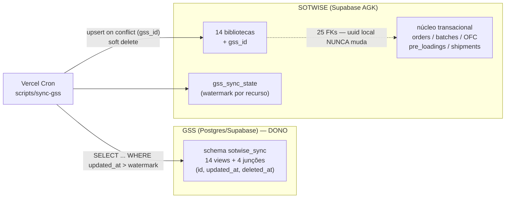

# Interligação SOTWISE ← GSS — bibliotecas

Especificação da sincronização das **14 bibliotecas** (cadastros de referência)
entre o banco externo **GSS** e o banco do SOTWISE.

Complementa [`docs/SCHEMA.md`](SCHEMA.md) (schema do nosso lado) e
[`docs/API.md`](API.md) (a API REST atual, que esta decisão torna obsoleta — §7).

> ⚠️ **Revisado pelo ERD do GSS** (recebido em 2026-08-11 — ver
> [`docs/MAPEAMENTO_GSS.md`](MAPEAMENTO_GSS.md)). O schema real deles contradiz
> três premissas do contrato abaixo: **não existe `deleted_at`** em modelo nenhum
> (§3.2), a **PK é inteira, não uuid** (o que inviabiliza o caminho A do §5 como
> estava escrito), e **`Supplier` — fonte das nossas `factories` — não tem
> `updated_at`** (§4.4). O mapeamento traz os substitutos. A arquitetura (pull,
> GSS como dono, `gss_id` como pareamento) segue válida.
>
> ⚠️ **Revisado de novo pelo acesso real** (2026-08-14 — ver §9). O acesso **não
> é ao Postgres**: é uma **API REST Django** (`api.gssdatahub.com/v1`) atrás de
> Cloudflare Access + JWT. Isso derruba o §3 inteiro como *plano* — não há schema
> `sotwise_sync`, nem view, nem role read-only, nem `updated_at` filtrável, nem
> paginação. O §3 fica como o **contrato ideal a negociar**; o §9 descreve o que
> existe e o que já foi executado em cima disso.
>
> 📥 **Nova via _inbound_ (2026-08-24) — o GSS cria ORDERS.** Tudo neste
> documento é _pull_ (SOTWISE puxa bibliotecas; GSS é dono delas). A partir de
> agora o GSS também **empurra** pedidos: `POST /api/gss/orders` cria/atualiza
> uma order no SOTWISE. É a **primeira via _push_ GSS → SOTWISE** e é de
> **pedidos**, não de bibliotecas — direção oposta ao resto daqui. Contrato do
> payload, idempotência (`orders.gss_id`) e a cascata do checklist (trigger
> `trg_orders_seed_checklist`) estão em
> [`docs/regras_de_negocio.md` §3.7.5](regras_de_negocio.md#375-order_checklist_steps--step_attachments).
> Env: `GSS_INBOUND_SECRET`.

---

## 1. Decisões que definem o desenho

| Questão | Decisão |
|---|---|
| **O que é o GSS** | Postgres / Supabase. Dá para ler direto — sem depender de API intermediária. |
| **Quem é o dono das bibliotecas** | **O GSS.** Ele passa a ser o único lugar onde biblioteca é criada ou editada. |
| **Papel do SOTWISE** | **Consumidor read-only.** Nada de biblioteca nasce ou muda aqui. |
| **Quem inicia o sync** | **Nós.** Pull agendado: um job nosso lê o GSS e aplica localmente. |

Consequências diretas:

- **Não existe conflito de escrita.** Não há last-write-wins, não há merge de
  campo — o GSS sempre ganha, porque só ele escreve.
- **O GSS não precisa implementar nada além de *deixar ler*** (§3). Nenhuma
  chamada sai do GSS na nossa direção.
- **As telas de Registration viram somente-leitura** e a API `POST /api/*`
  perde a razão de existir (§7).

### 1.1 As 14 bibliotecas

`countries` · `cities` · `pols` · `pods` · `factories` · `categories` ·
`contacts` · `agents` · `carriers` · `clients` · `exporters` ·
`business_units` · `order_types` · `shipment_models`

Mais as **4 junções** entre elas, que também são dado de biblioteca e precisam
vir do GSS: `city_pols`, `category_factories`, `agent_contacts`,
`carrier_agents`.

---

## 2. Arquitetura



**A invariante que sustenta tudo:** o `uuid` local de cada biblioteca é
imutável. 25 FKs do núcleo transacional apontam para ele, sobre 9.495 linhas de
`order_factory_category`, 3.144 lotes e 1.389 pre-loadings
([SCHEMA §3.3](SCHEMA.md#33-quem-aponta-para-as-bibliotecas)). O id do GSS entra
numa coluna **paralela** (`gss_id`), nunca como PK.

Por isso o pull nunca faz `delete`: só `deleted_at`. Apagar uma `factory` de
verdade derrubaria linhas de `order_factory_category` — ou seria travado pela FK,
que não tem cláusula `on delete`.

---

## 3. Contrato que o GSS precisa cumprir

O que pedimos do lado do GSS é modesto: **expor leitura estável**. Recomendação
concreta, já que é Postgres:

### 3.1 Acesso

Criar um **schema `sotwise_sync`** com uma view por recurso e um **role
read-only** dedicado:

```sql
-- no GSS
create role sotwise_reader login password '<forte>' noinherit;
create schema if not exists sotwise_sync;
grant usage on schema sotwise_sync to sotwise_reader;
grant select on all tables in schema sotwise_sync to sotwise_reader;
alter default privileges in schema sotwise_sync
  grant select on tables to sotwise_reader;
```

Views em vez de acesso às tabelas cruas: o GSS fica livre para refatorar por
dentro sem quebrar o nosso puller, e nós vemos só as colunas do contrato.

Conexão: string do **pooler** do Supabase do GSS (porta 6543, modo transaction).
Se preferirem PostREST em vez de conexão direta, serve igual — basta expor o
schema `sotwise_sync` na API e nos dar uma chave; o contrato de colunas é o
mesmo. **Não** queremos a `service_role` do GSS: privilégio a mais sem uso.

### 3.2 Colunas obrigatórias em toda view

| Coluna | Tipo | Regra |
|---|---|---|
| `id` | uuid ou text | **Estável e imutável.** É o que gravamos em `gss_id`. Se mudar, o registro é tratado como novo e duplica. |
| `name` | text not null | Nome canônico exibido. |
| `updated_at` | timestamptz not null | Atualizado **em toda** alteração, por trigger. É o cursor do sync incremental — se não subir, a mudança nunca chega aqui. |
| `deleted_at` | timestamptz | Soft delete. **O GSS não deve apagar linha de biblioteca** — se apagar, o registro simplesmente para de aparecer no pull e nós nunca sabemos que ele saiu. |

⚠️ **Alteração de vínculo também precisa mexer no `updated_at` do pai.** Se
alguém troca as fábricas de uma categoria sem que `categories.updated_at` suba, o
pull incremental não vê nada e a junção fica velha. Vale para as 4 junções.

### 3.3 Colunas por recurso

Além de `id`, `name`, `updated_at`, `deleted_at`:

| View | Colunas extras | Observação |
|---|---|---|
| `countries` | — | |
| `cities` | — | |
| `pols` | — | |
| `pods` | — | |
| `factories` | — | 752 linhas hoje do nosso lado |
| `categories` | — | exige ≥ 1 fábrica vinculada |
| `carriers` | — | |
| `shipment_models` | — | |
| `clients` | `country_id` | id **do GSS** de um country; nullable |
| `exporters` | `acronym` text not null | |
| `contacts` | `email` text, `email_na` boolean, `phone_number` text | regra: ou `email` preenchido, ou `email_na = true` |
| `agents` | `country_id`, `location`, `email`, `email_na`, `phone_number` | `location` **só aceita** `brazil` ou `china` (enum local) |
| `business_units` | — | ícone **não** vem pelo sync (§6.4) |
| `order_types` | `color` text | ícone **não** vem pelo sync (§6.4) |

FKs entre bibliotecas (`clients.country_id`, `agents.country_id`) vêm como **id
do GSS**, não como uuid nosso — a tradução é nossa.

### 3.4 Junções

Uma view por junção, com os dois ids do GSS:

| View | Colunas |
|---|---|
| `city_pols` | `city_id`, `pol_id` |
| `category_factories` | `category_id`, `factory_id` |
| `agent_contacts` | `agent_id`, `contact_id` |
| `carrier_agents` | `carrier_id`, `agent_id` |

Junção não tem id próprio nem timestamp — ela é sincronizada **como conjunto**:
para cada pai que apareceu no pull, apagamos e regravamos os vínculos dele
(mesma estratégia do `syncAgentContacts` atual). Daí a exigência do §3.2 de subir
o `updated_at` do pai.

> **Cardinalidade — respondida, mas com uma reviravolta.** `category_factories` é
> **M-N** confirmado (`SupplierCategory` é junção de verdade, com `city` + `code`
> a mais). Já `city_pols`, embora modelada M-N, é usada como **1-1** nos dados:
> 74 `pols` para 23 portos reais, cada linha com uma cidade só. As nossas
> bibliotecas `pols` e `factories` **são junções desnormalizadas** — o que muda a
> granularidade do pareamento. Ver
> [MAPEAMENTO_GSS §2](MAPEAMENTO_GSS.md#2-o-que-os-dados-provam-sobre-o-glossário)
> e §6.

> **Produtos da fábrica — decisão de 2026-08-25.** A "reviravolta" acima virou
> tabela: `supplier-category` NÃO é junção pura — é a **tabela de PRODUTO** da
> fábrica (id próprio, `code`, `city`, timestamps). A mesma fábrica repete o par
> (categoria) em linhas distintas pelo `code`: **1067 linhas / 1035 pares**, 287
> codes, 139 cidades. O sync colapsava isso na junção `category_factories` e
> perdia `code`/`city` + ~32 linhas. Modelado como **`factory_products`** (aditivo,
> a junção continua para os filtros do app): migration
> `20260825120000_factory_products.sql` + `scripts/sync-gss/sync-products.ts`
> (upsert por `gss_id`, traduz supplier/category/city → uuid). Validado ao vivo:
> **1058 dos 1067 resolvem** (9 unresolved = fábricas ainda "Só no GSS"). Pronto
> no código; aplicação no AGK sob demanda.

---

## 4. Do nosso lado

### 4.1 `gss_id` — ✅ **aplicado em produção (2026-08-14)**

`supabase/migrations/20260803120000_add_gss_id_to_libraries.sql` adiciona
`gss_id text unique` nas 14 bibliotecas. Aplicado junto com `gss_sync_state`
(§4.2). Conferido: 14 colunas `gss_id` presentes.

`unique` simples (não parcial) permite vários `null` — registros ainda não
pareados — e habilita `on conflict (gss_id)`.

### 4.2 Watermark do sync

```sql
create table public.gss_sync_state (
  resource      text primary key,        -- 'countries', 'agents', …
  watermark     timestamptz,             -- maior updated_at já processado (do relógio do GSS)
  last_run_at   timestamptz,
  last_status   text,                    -- 'ok' | 'error'
  last_error    text,
  rows_upserted integer not null default 0,
  rows_deleted  integer not null default 0
);
```

### 4.3 Ordem obrigatória do pull

FK entre bibliotecas manda a ordem:

```
1. countries
2. contacts · factories · categories · cities · pols · pods · carriers ·
   exporters · business_units · order_types · shipment_models   (independentes)
3. clients · agents                    (precisam de countries)
4. city_pols · category_factories · agent_contacts · carrier_agents  (junções)
```

### 4.4 Algoritmo

Por recurso, em ordem:

1. `select * from sotwise_sync.<recurso> where updated_at > watermark - interval '5 minutes' order by updated_at` — a **sobreposição de 5 min** cobre desvio de relógio e transações que commitaram fora de ordem. O upsert é idempotente, reprocessar não custa nada.
2. Traduzir FK: `country_id` do GSS → uuid local, via `gss_id`. Não achou → registra pendência e deixa `null` (não inventa).
3. `insert … on conflict (gss_id) do update set …` — atualiza `name` e os campos do recurso. **Nunca** toca em `id`, `created_at`, `created_by` nem `bubble_id`.
4. Linha com `deleted_at` no GSS → grava `deleted_at` local. Se voltar a `null` lá (restaurada), limpa aqui.
5. Avança o watermark para o **maior `updated_at` lido**, e não para `now()` nosso — o relógio de referência é o do GSS.
6. Grava o resultado em `gss_sync_state` e loga contagens.

Modo **`--dry-run`** obrigatório: imprime o que faria sem escrever. É como a
primeira execução vai ser validada.

### 4.5 Agendamento

Vercel Cron chamando uma rota protegida (`CRON_SECRET`), ou o job rodando como
script. **Confirmar a frequência que o plano da Vercel permite** antes de
prometer intervalo curto — em plano Hobby o cron é diário. Se precisar de minutos,
ou o projeto sobe de plano, ou o agendador vai para outro lugar (pg_cron no nosso
Supabase, GitHub Actions).

---

## 5. O pareamento inicial — o ponto crítico

Hoje as bibliotecas locais têm **1.510 linhas** vindas do Bubble, todas em uso
pelo transacional:

| | | | |
|---|---:|---|---:|
| factories | 752 | clients | 115 |
| contacts | 288 | cities | 51 |
| agents | 144 | pods | 26 |
| categories | 115 | carriers | 26 |
| pols | 74 | business_units | 7 |
| shipment_models | 6 | order_types | 5 |
| exporters | 4 | countries | 3 |

E o GSS **vai começar a registrar agora**. Se ele começar do zero e nós só
consumirmos, o resultado é duplicata em massa: a “Factory X” que ele cadastra
entra como registro novo, sem `gss_id` para casar com a nossa “Factory X” que
9.495 linhas de `order_factory_category` já referenciam.

Três caminhos, do melhor para o pior:

| Caminho | Como funciona | Risco |
|---|---|---|
| **A — Semear o GSS com a nossa base** (recomendado) | Exportamos as 14 bibliotecas com o uuid local; o GSS importa cada registro guardando esse uuid num campo **`sotwise_id`** (indexado, nullable, exposto na view) — a PK dele é `BigAutoField` sequencial e não aceita o nosso uuid, então o pareamento é por esse campo, e o `gss_id` que gravamos continua sendo o `id` inteiro deles. Pareamento **1:1 exato**, zero ambiguidade, zero duplicata. | Depende do GSS aceitar importar antes de começar a operar, e de criar o campo. |
| **B — Pareamento por nome normalizado** | Primeiro pull casa por `lower(trim(name))` e grava o `gss_id` no registro local existente. O que casar sozinho é automático; o resto vira fila de resolução manual. | 752 fábricas e 288 contatos migrados do Bubble com duplicatas prováveis: haverá casos de 2 locais → 1 do GSS, que exigem **merge** (repontar FKs e depois soft-delete), não só pareamento. |
| **C — Não parear** | O GSS cresce em paralelo e o histórico local fica órfão. | Cada biblioteca passa a ter duas versões de tudo. **Inaceitável.** |

Independente do caminho: enquanto um registro local tem `gss_id = null`, ele
continua funcionando no histórico — só não recebe atualização do GSS. Um
relatório de não-pareados é entregável do sync (§6.5).

Posso gerar o export das 14 bibliotecas (uuid + campos, formato CSV ou JSON) para
o caminho A a qualquer momento — os dados estão acessíveis.

---

## 6. Casos de borda que precisam de decisão

### 6.1 GSS “apaga” algo que está em uso

Nós só marcamos `deleted_at`. O efeito prático: o registro **desaparece dos
dropdowns** de novos cadastros, mas segue visível nos pedidos antigos que o
referenciam. É o comportamento correto e já é o que as telas fazem hoje. O sync
emite alerta quando o excluído está em uso.

### 6.2 Registro local sem par no GSS

Fica com `gss_id = null` para sempre e nunca mais é atualizado. Precisa de
inventário periódico — não é erro, é dívida.

### 6.3 Duplicata local (2 locais → 1 GSS)

Só um dos dois pode receber o `gss_id` (a constraint é `unique`). O outro precisa
de **merge**: repontar as FKs do transacional para o sobrevivente e depois
soft-delete. É trabalho manual assistido; não dá para automatizar sem risco.
Vale escrever uma ferramenta de merge se o volume do pareamento B for alto.

### 6.4 Ícones e cores

`business_units.icon_path` e `order_types.icon_path` são **paths no nosso
Supabase Storage** — arquivo não viaja pelo sync. Proposta: ícone continua sendo
gerenciado aqui (única exceção ao read-only), amarrado ao registro pelo `gss_id`;
o GSS manda `name` e `color`. Se o cliente quiser o ícone também no GSS, aí o
contrato precisa de bytes ou URL pública, e o sync ganha um passo de download.

### 6.5 Observabilidade

Mínimo para o sync ser confiável:

- **Log de execução** (`gss_sync_state` + saída do job): lidos, upsertados, soft-deletados, erros.
- **Relatório de não-pareados** por recurso.
- **Relatório de “excluído no GSS mas em uso aqui”**.
- **Alerta de falha**: 2 execuções seguidas com erro precisam avisar alguém.

---

## 7. O que essa decisão aposenta

| Hoje | Depois |
|---|---|
| `POST /api/{recurso}` (14 recursos) — criar biblioteca por API | **Sai.** Criar aqui produziria registro sem `gss_id`, ou seja, duplicata garantida. |
| Telas de Registration com Create / Edit / Delete | **Read-only**, com aviso de onde o dado é mantido. Só o ícone permanece editável (§6.4). |
| Server Actions de CRUD dos cadastros (`domain/registration/*`) | Reduzidas a leitura. |
| `GET /api/{recurso}` | **Fica** — é a nossa API de leitura para terceiros, independente do sync. |
| [`docs/API.md`](API.md) | Reescrever a parte de escrita (`POST`/`PATCH`) quando o read-only entrar. O `PATCH /api/{recurso}/{id}` foi adicionado em 25/08/2026 (create+read+update, sem PUT/DELETE) — decisão do Henrique de dar caminho de atualização ao integrador enquanto a Fase 5 (§9.10) segue adiada. `gss_id` continua ignorado (nem no POST nem no PATCH) e não há upsert: nenhuma dessas vias está no caminho do pull. |

---

## 8. Plano de execução

| Fase | Entrega | Status |
|---|---|---|
| **0** | Contrato do §3 aceito pelo dono do GSS; caminho de pareamento (§5) escolhido; e as **16 fricções** de [MAPEAMENTO_GSS §6](MAPEAMENTO_GSS.md#6-fricções-por-ordem-de-gravidade) resolvidas — as 4 primeiras (sem `Contact`, sem `ShipmentModel`, `Agent` sem país/location, sem `carrier_agents`) bloqueiam features que já estão em produção | ⚠️ parcial — acesso liberado (API, não Postgres); caminho **B** escolhido; fricções em aberto |
| **1** | `gss_id` aplicado em produção (migration já escrita) + `gss_sync_state` criada | ✅ 2026-08-14 |
| **2** | Pareamento inicial: export para semear o GSS (caminho A) **ou** rotina de match por nome + fila de resolução (caminho B) | ✅ 841 pareamentos + 618 inserts de geografia gravados; fila de merge (§9.5) e 121 inserts retidos (§9.7) |
| **3** | Puller com `--dry-run`, ordem do §4.3, upsert por `gss_id`, tradução de FK, junções como conjunto | ✅ motor em `lib/gss/sync.ts` (§9.7): vínculo, campos, insert, revive e detecção de sumiço. **`category_factories` sincronizada como conjunto** (19/08/2026, `planJunction`): insert padrão, delete só com `--soft-delete`, vínculo com lado sem `gss_id` intocado — 307 vínculos gravados em prod. Faltam as **outras 3 junções** (`city_pols`, `agent_contacts`, `carrier_agents`) e `contacts` |
| **4** | Cron + logs + os 3 relatórios do §6.5 | ✅ `app/api/cron/sync-gss`, diário às 9h UTC; `gss_sync_state` gravado por recurso. Falta alerta de 2 falhas seguidas |
| **5** | UI de Registration read-only, `POST /api/*` retirado, `docs/API.md` atualizado | ⏸️ **adiada por decisão** (14/08/2026) — ver §9.10 |

---

## 9. Estado da execução (2026-08-14)

### 9.1 O acesso que existe de verdade

API REST Django em `https://api.gssdatahub.com/v1`, com **duas** camadas de auth:
service token do **Cloudflare Access** (headers em toda requisição) + **JWT** do
AGK-Core obtido por login. Cliente em [`lib/gss/client.ts`](../lib/gss/client.ts).

O que a API **não** tem, e o efeito em cada premissa do §3/§4:

| Premissa | Realidade | Efeito |
|---|---|---|
| `updated_at` filtrável (§3.2) | não existe filtro server-side | **sem sync incremental**: todo pull lê a lista inteira. O watermark do §4.2 fica sem uso por ora |
| `deleted_at` (§3.2) | não existe | sumiço só é detectável por diferença de conjunto (§9.6) |
| paginação | não há — a lista inteira volta num array | aceitável na escala atual (maior recurso: 698 suppliers) |
| id estável | ✅ inteiro | gravamos como texto em `gss_id` |
| FK | `<campo>` (id) + `<campo>_name` de conveniência | tradução para uuid local é nossa (§4.4 passo 2) |

### 9.2 Caminho B executado — pareamento por nome

`scripts/sync-gss/sync.ts`, `--dry-run` por padrão. Retrato do **primeiro**
pareamento, antes de qualquer insert (gravado com `--commit --pair-only`:
**841 `gss_id`**). `countries` e `cities` já não estão mais assim — receberam os
inserts de geografia depois (§9.7): hoje são 19 e 652 linhas, quase todas pareadas.

| Recurso | local | GSS | casam | só GSS | só local | dupes locais |
|---|---:|---:|---:|---:|---:|---:|
| countries | 2 | 24 | 2 | 22 | 0 | 0 |
| cities | 51 | 646 | 45 | 601 | 6 | 0 |
| pols | 72 | 1 | 0 | 1 | 22 | 0 |
| pods | 25 | 12 | 11 | 0 | 14 | 0 |
| clients ← `customer` | 114 | 92 | 89 | 3 | 25 | 0 |
| exporters | 4 | 4 | 4 | 0 | 0 | 0 |
| order_types | 4 | 4 | 3 | 1 | 1 | 0 |
| business_units | 6 | 6 | 6 | 0 | 0 | 0 |
| factories ← `supplier` | 751 | 698 | 589 | 109 | 110 | 39 |
| categories ← `supplier-category` | 115 | 99 | 92 | 7 | 8 | 3 |

> Unidades: `local` e `GSS` contam **linhas**; `casam`, `só GSS` e `só local`
> contam **nomes normalizados distintos**. A diferença expõe duplicata local por
> nome: `pols` 72 linhas / 22 nomes, `factories` 751 / 699, `categories` 115 /
> 100 — as outras sete bibliotecas estão limpas. As duas naturezas dessa
> diferença (estrutura em `pols`, sujeira em `factories`) estão em §9.3 e §9.5.
> `port` do GSS já entra aqui roteado por país (§9.3).

### 9.3 `port` é roteado por país — POL = China, POD = BR

A tabela `port` do GSS **não** é a união dos nossos `pols` + `pods`: ela contém
os portos de **destino** (Itajaí, Paranaguá…) mais o placeholder *"Any port in
China"*. Os nossos 72 `pols` são portos chineses de embarque (Tianjin, Shenzhen,
Ningbo…) que **não existem** na lista deles — daí o pareamento 0/72.

Regra implementada: `port` do GSS é distribuído por `country_name` — **China →
`pols`**, **resto → `pods`**. Na prática o lado China tem hoje uma linha só.

> ⛔ **Mas `pols` não é sincronizável por nome — é um problema de granularidade,
> não de dados faltando.** As 72 linhas cobrem 22 portos, e a conferência linha a
> linha (2026-08-14) mostra que **cada linha repetida aponta para uma cidade
> distinta** via `city_pols` (Ningbo aparece 12×: Taizhou, Jiading, Hangzhou,
> Ningbo, Wuxi, Changzhou, Yuhuan, Wenzhou, Yiwu, Dongguan, Yangzhou, Lishui).
> Ou seja: um `port` do GSS é **um porto**; um `pol` nosso é **(cidade, porto)** —
> a junção `city_pols` desnormalizada, exatamente o que o §3.4 já suspeitava.
>
> Consequência: não existe pareamento 1:1. Se o GSS cadastrar "Ningbo", ele
> corresponde às **12** linhas ao mesmo tempo, e `gss_id` é `unique` — só uma
> poderia recebê-lo. Inserir o "Any port in China" do GSS em `pols` também é
> indesejado: nasceria um `pol` sem cidade, o mesmo padrão órfão de uma das 4
> linhas de Chongqing.
>
> **`pols` fica fora do sync até haver decisão de modelagem** — as candidatas são
> (a) `pols` vira biblioteca de portos de verdade + `city_pols` volta a ser M-N
> real, com o vínculo cidade→porto preservado na migração, ou (b) `pols` é
> declarado SOTWISE-owned e nunca sincroniza. A regra POL=China/POD=BR segue
> válida para o **roteamento**; o que não se sustenta é o **pareamento**.
>
> **Paliativo de UI (2026-08-18), sem tocar no schema:** o seletor de Port of
> Loading exibia o mesmo porto dezenas de vezes (Ningbo 12×), impossível de
> escolher. Agora, na etapa Port of Loading do pre-loading, a **cidade escolhida
> na etapa City filtra os pols** (via `city_pols`) e a lista é **deduplicada por
> nome** — sobra o(s) porto(s) daquela cidade. Nos **filtros** (Pre-loading e
> Shipments) a lista de POL também é deduplicada por nome e a filtragem passou a
> **casar por nome do porto** (não por `pol_id`), senão escolher "Ningbo" pegaria
> só 1 das 12 linhas. Isso é camada de exibição; a decisão de modelagem (a)/(b)
> segue pendente.

### 9.4 Pareamento é *sticky* (e por que isso importa)

O match é por nome normalizado (`NFD` sem acento, minúsculo, espaço colapsado) —
exato, sem fuzzy. Duas fontes de ambiguidade, e a regra de cada uma:

- **Duplicata local** (2 locais → 1 GSS): só a 1ª linha recebe `gss_id` (a
  constraint é `unique`); as demais entram na fila de merge do §6.3. Hoje: 39 em
  `factories`, 3 em `categories`. A escolha da "1ª" é estável porque `loadLocal`
  ordena por `id`.
- **Duplicata no GSS** (mesmo `company_name`, ids e `company` diferentes — ex.
  *Xintianben*: supplier 122 → company 700, supplier 596 → company 812; idem
  *Haorui* 371→211 e 590→809): escolher entre eles pelo nome é chute. Regra:
  desempate por **menor id**, mas o vínculo é **sticky** — se a linha local já
  aponta para *qualquer* id válido daquele nome, ele **não é repontado**.
  Trocar um chute por outro em dado já gravado não é ganho.

Sem essas duas regras o script tinha *churn*: a API devolve o array em ordem
variável, então o "primeiro" mudava a cada execução. Com elas, duas execuções
seguidas dão `+gss_id 0` — idempotente.

### 9.5 A fila de merge de `factories` é menor do que parece

`scripts/sync-gss/sync.ts --dupes` imprime a fila completa. Em `factories` são 38
grupos por nome exato (40 normalizando caixa e espaço). Cruzando cada grupo com o
uso real em `order_factory_category` (2026-08-14):

| Situação | Grupos | Tratamento |
|---|---:|---|
| nenhuma linha em uso | 19 | soft-delete direto, só unindo as categorias |
| exatamente 1 em uso | 18 | merge trivial — a linha em uso é a sobrevivente |
| 2+ em uso | **1** (`MSH`, 2 de 5) | único caso que exige repontar FK de verdade |

A causa é visível nos dados: a duplicata nasceu de **cadastrar a fábrica de novo
para pendurar outra categoria**, em vez de adicionar a categoria à existente —
`Heima` tem 4 linhas (Engine parts+Small parts / Metal Parts / Stand / Pedal), e
só a primeira tem pedidos. Como `category_factories` é M-N de verdade, o merge é
a união das categorias no sobrevivente. Diferente de `pols` (§9.3), aqui a
duplicata é **sujeira**, e fundir é o certo.

Fora da fila, e sem par no GSS: `asd` (2×), `123`, `Test` — lixo de teste, todos
com `ofc=0`. Limpeza, não merge.

### 9.6 O sync aplicando mudanças (o que faltava para "editou lá, mudou aqui")

Até 2026-08-14 o motor só **ligava** (`gss_id`) e **criava**. Edição no GSS não
chegava aqui — e havia um defeito pior: como o par era procurado **por nome**,
um rename na origem virava INSERT, que batia na unique de `gss_id` e derrubava a
execução. Agora o par é procurado **primeiro por `gss_id`**, e só depois por nome.

Motor em [`lib/gss/sync.ts`](../lib/gss/sync.ts), com dois pontos de entrada — o
CLI (`scripts/sync-gss/sync.ts`) e a rota do cron. Recebe o client do Supabase
por parâmetro porque `lib/supabase/admin.ts` tem `import "server-only"`, que
lança em script tsx. Cinco operações por recurso:

| Operação | O que é |
|---|---|
| **LINK** | linha sem `gss_id` que casa por nome ganha o vínculo |
| **FIELDS** | linha já pareada tem os campos atualizados a partir do GSS — é o que faz o rename chegar |
| **INSERT** | o que só existe no GSS, sujeito à política do §9.7 |
| **REVIVE** | pareada e soft-deletada aqui, ainda viva no GSS → `deleted_at` volta a nulo |
| **MISSING** | pareada aqui e ausente no GSS. **Só relata** — o soft-delete exige `--soft-delete` |

#### A grafia local ganha do GSS

Ao ligar o FIELDS, a comparação revelou 22 divergências que **não** deviam ser
aplicadas: o GSS grava os portos brasileiros sem acento (`Itapoá`→`Itapoa`,
`Paranaguá`→`Paranagua`, `Pecém`→`Pecem`) e alterna a caixa das fábricas
(`Aimesk`/`AIMESK`, `botong`/`Botong`). Aplicar degradaria nomes que aqui estão
certos. Regra adotada: **`name` só é reescrito quando o nome normalizado muda** —
ou seja, rename de verdade passa, variação de grafia não. `--force-casing`
desliga a proteção. As outras colunas não têm essa ressalva.

Ainda no FIELDS: valor `null` vindo do GSS **nunca** sobrescreve — ausência na
origem quase sempre é FK que não traduziu, não limpeza deliberada.

#### Aplicado em produção (2026-08-14)

- **89 `clients` ganharam país.** Os 114 estavam todos com `country_id` nulo;
  o GSS preencheu os que tinham par. Ganho puro, sem sobrescrever nada.
- **`exporters.Zenchum.acronym` ZC → ZM**, por decisão de manter o GSS como dono
  (os outros seguem outro padrão: ZAT=ZT, Zenya=ZY — vale conferir com a AGK).

Teste do rename, ponta a ponta: uma `factory` sem uso foi renomeada localmente
para `Deyu RENOMEADO`; o dry-run seguinte a classificou como FIELDS
(`{"name":"Deyu"}`) e manteve `insert` em 109 — nada de linha nova nem de
violação de unique, que era o comportamento antigo. Depois, restaurada.

#### O agendado

[`app/api/cron/sync-gss`](../app/api/cron/sync-gss/route.ts), GET protegido por
`CRON_SECRET` (`Authorization: Bearer`, comparado em tempo constante), agendado
em `vercel.json` para **9h UTC / 6h de Brasília, diário** — cabe no plano
gratuito da Vercel, que só permite cron diário. `?dry=1` roda o plano completo
sem gravar. Execução medida: **~4s**.

A política do agendado é conservadora de propósito: campos e vínculos sempre,
INSERT só de `countries`/`cities`, e **`softDelete` desligado** — sem
`deleted_at` na origem o sumiço é inferido por diferença de conjunto, e uma
falha parcial da API viraria exclusão em massa. Cada recurso grava
`gss_sync_state` (status, linhas, erro), inclusive quando falha.

> ⚠️ **`CRON_SECRET` precisa ser configurada na Vercel** — sem ela a rota
> responde 503 e o cron nunca roda. Mesma pendência de ambiente do Copilot e do
> Resend.

### 9.7 Em aberto

1. **Inserts: geografia liberada, o resto retido.** Gravados em 2026-08-14
   (`--commit --insert=countries,cities`): **601 cidades + 17 países = 618**.
   Amostragem prévia das cidades não achou nome curto, numérico, de teste nem com
   espaço nas bordas. Os **17** países são os 22 do GSS menos `Generic`,
   `Legacy Import`, `To be defined`, `Unknown` — placeholders internos deles, não
   países — e menos a grafia `Singapura` (fica `Singapore`): com `gss_id` único,
   uma linha nossa não carrega os dois ids das duas grafias. A lista está em
   `COUNTRY_SKIP` no script. Consequência aceita: `customer` do GSS apontando
   para qualquer um dos 5 chega com `country_id` nulo, e a Singapura duplicada é
   para o dono do GSS corrigir na origem.
   **Retidos: 111** — 103 factories, 7 categories e 1 pol. Eram 121 até a
   revisão por semelhança do §9.8 vincular 11 deles (entre eles o `order_type`
   *"Sample"*, os 3 clients e o carrier *MSC*, que deixaram de ser "novos" e
   viraram par do que já existia). As factories e categories esperam a fila de
   merge (§9.5): antes dela, inserir uma "fábrica nova" do GSS pode estar
   criando a terceira cópia de algo que já existe duplicado aqui. O `pol` é
   barrado pelo §9.3.
2. **Fila de merge das bibliotecas** (§9.5) — **ferramenta escrita** (17/08/2026):
   [`scripts/sync-gss/merge-libraries.ts`](../scripts/sync-gss/merge-libraries.ts),
   config por tabela com o grafo de FK; dry-run por padrão, `--commit` aplica
   (backup JSON por tabela em `tmpdir`). Sobrevivente = a linha com `gss_id`
   (canônica); sem `gss_id`, a mais usada (desempate por id). Repõe as FKs
   simples e **une** as junções de PK composta (`category_factories`,
   `agent_contacts`, `carrier_agents`), depois soft-deleta as cópias. Idempotente
   e re-rodável — feito pra rodar DE NOVO após cada re-migração total do Bubble.
   Rodar por tabela: `merge-libraries.ts categories agents`.

   **Proteção:** grupos de nome placeholder/branco (`""`, `n/a`, `na`, `none`,
   `tbd`, `-`…) NÃO são fundidos — "mesmo placeholder" ≠ "mesma entidade" (ex.: 6
   contatos "N/A" com telefones diferentes). Viram relato para decisão humana.

   Aplicado em 17/08/2026 (produção AGK): `factories` 40 grupos / 52 cópias / 449
   vínculos; `categories` 4/6; `contacts` 12/12; `agents` 6/6 — todos sem caso de
   decisão humana, 0 FKs órfãs após. **Segurados p/ revisão manual** (placeholder,
   quase todos lixo de teste com 0 uso): 9 `categories` em branco, e em `contacts`
   3 em branco + 4 "N/A" + 2 "NA".

   **Revisão (só leitura):**
   [`scripts/sync-gss/dup-report.ts`](../scripts/sync-gss/dup-report.ts) varre
   TODAS as bibliotecas e gera um `.xlsx` (aba Resumo + aba Duplicatas) com cada
   grupo classificado — `dup real (mergeável)`, `PLACEHOLDER (revisar à mão)` ou
   `MULTI-GSS (decisão humana §9.4)` — contando refs pra expor lixo 0-uso e
   sugerindo o sobrevivente pela mesma regra do merge. **Não escreve nada.** É o
   passo de conferência do runbook: após `sync.ts --commit` + `merge-libraries.ts
   --commit`, rodar `dup-report.ts` pra ver o retrato atual do que sobrou (os
   placeholders e os `pols` do §9.3). Como cada re-migração recria as duplicatas,
   revisar o retrato novo vale mais que anotar a decisão de placeholder de hoje.
   **Revisão do documento comparativo (31/08/2026)** — o dedup do
   `merge-libraries.ts` agrupa por nome normalizado, então nunca enxerga a cópia
   *escrita errado* (`Fenguang` ≠ `Fengguang`, `Zhuguan` ≠ `Zhiguan`): ela vive
   no documento como "Só no nosso banco (sem gss_id)". A revisão do Rapha sobre a
   aba `Suppliers → factories` trouxe 34 decisões nossas (as marcadas "@Gustavo"
   são para a origem corrigir), aplicadas por
   [`scripts/sync-gss/aplicar-revisao-fabricas.ts`](../scripts/sync-gss/aplicar-revisao-fabricas.ts)
   — mesma mecânica de FK + backup do merge, só que dirigida por **pares
   explícitos**. Aplicado em produção 31/08/2026: **17 apelidos fundidos** (149
   referências movidas) e **12 retiradas** do cadastro; 762 → 733 fábricas ativas.
   Esse script também repõe `factory_products`, que o `merge-libraries.ts` ainda
   não conhece (a tabela nasceu depois, em `20260825120000`).

   **"Pode deletar" virou soft-delete, não delete.**
   `order_factory_category.factory_id` é `ON DELETE CASCADE`: apagar a fábrica
   apagaria junto entradas Factory × Category de pedidos reais — e as 12 tinham
   1 a 4 orders cada. O soft-delete tira do cadastro e das seleções e deixa o
   histórico do pedido de pé.

   **Fica aberto:** 5 linhas que "não são fábrica, são ponto de consolidação"
   (`Zenchum Office` 826 usos, `Best services intl Freight Ltd` 42, `Hangzhou
   Laiying` 7, `Shouzen` 7, `Unknow` 7). Fábrica e ponto de consolidação dividem
   a tabela `factories` (via `pre_loading_checklist_steps.consolidation_point_id`);
   separar os dois é mudança de modelo, não correção de dado.
3. **`pols`** — decisão de modelagem pendente (§9.3). É o item que trava o
   recurso inteiro, não um ajuste de dado.
4. **Lixo local sem par** — `asd`, `123`, `Test`: candidatos a limpeza, não a merge.
5. **Recursos fora do sync**: `contacts` (← `company`, passo dedicado) e as
   **4 junções** do §3.4. `agents` e `carriers` **entraram** (§9.8) — o que não
   existe mesmo é `shipment_models`, que segue SOTWISE-owned.
6. **Soft-delete e detecção de sumiço** — sem `deleted_at` na origem, exige
   diferença de conjunto sobre o pull completo. Não implementado.

### 9.8 `agents` e `carriers` existem no GSS — e o pareamento por semelhança

**Correção do §3 e do MAPEAMENTO:** a API **tem** `/core/agent/` e
`/core/carrier/`, ao contrário do que o ERD indicava. O que não existe é
`shipment-model` (seis grafias tentadas, todas 404). Apareceram também
`/core/currency/` (3) e `/core/province/` (129), sem equivalente aqui.

Os dois estão praticamente vazios: **1 registro cada** — `Asia Shipping` e
`MSC`, criados em 12/11/2025 com e-mail genérico (`msc@msc.com`), com cara de
semente. Contra 143 `agents` e 24 `carriers` nossos.

Por isso `agents`/`carriers` entram com duas travas:

- **e-mail como critério, nunca como valor.** O e-mail confirma o par que o nome
  sugere, mas o `asiashipping@as.com` deles não substitui o
  `sales15.tsn@cn-asgroup.com` nosso. Implementado como `fillOnly`: nesses
  recursos o GSS só preenche campo vazio.
- `N/A` e `NA` são ignorados como chave — é o placeholder do cadastro antigo, e
  casaria dezenas de agentes entre si.

#### Pareamento por semelhança (revisão humana, nunca automático)

Cadastro manual erra grafia dos dois lados, então o dry-run passou a listar os
**nomes parecidos que não casaram exato** — sem nunca gravá-los. A medida
combina distância de edição com contenção **por palavra** (não por substring:
`MSC` é palavra dentro de `MSC Mediterranean Shg`, enquanto `YI` é só um pedaço
de `Yican` — a primeira versão, por substring, casou um nome de duas letras com
oito fábricas diferentes). Sufixos jurídicos (`ltda`, `co`, `ltd`, `do brasil`)
são descartados antes de comparar. Limiar 0,82.

A fila sai em `scripts/sync-gss/review-similares.ts`, que enriquece cada
candidato com o que realmente decide: **a categoria de produto e a cidade dos
dois lados**, mais o uso no transacional. Foi o que separou typo de homônimo:

| Veredito | Casos | Evidência |
|---|---|---|
| mesma empresa | `Chuangxiang`→`Chuanxiang`, `Fenguang`→`Fengguang`, `Fenying`→`Fengying`, `Hai wang`→`Haiwang`, `Jinchum`→`Jinchun`, `Zhejiang Kreation`→`Kreation` | categoria de produto idêntica (Carburetor, Seat, Sensor…) |
| empresas diferentes | `Tongqing`≠`Dongqing`, `Yicheng`≠`Licheng`, `Yicheng`≠`Yucheng` | **nenhuma** categoria em comum (Hand switch × Equipment; Electric parts × Plastic) |
| sem prova | `Bobang(Bonai)`, `Xiwang` | nossa linha sem categoria e sem pedido — ficaram de fora |

Os 11 vínculos aprovados vivem em
[`scripts/sync-gss/link-aprovados.ts`](../scripts/sync-gss/link-aprovados.ts),
em código e versionados: vínculo decidido por gente precisa de rastro de quem,
quando e com base em quê. O script é idempotente e recusa nome ambíguo.

`Movile` foi decisão de negócio, não grafia: o GSS separa `Movile - AM` (#45) e
`Movile - SP` (#46); o nosso `Movile - SP` já pareava sozinho, e o Henrique
confirmou que o `Movile` sem sufixo (18 orders) é a unidade do Amazonas.

#### Quatro nomes em que a nossa grafia venceu

Vincular fez o GSS querer reescrever os 11 nomes. Sete eram melhoria (os typos
eram nossos) e foram aplicados, junto com o país dos 3 clientes. Quatro não —
estão em `NOME_LOCAL_VENCE`, porque aqui o nome carrega mais informação:

| Fica | Em vez de | Por quê |
|---|---|---|
| `Zhejiang Kreation` | `Kreation` | a província distingue a planta |
| `MSC - Mediterranean Shg Co` | `MSC` | razão social completa |
| `Samples` | `Sample` | rótulo em 77 orders |
| `Marquinhos` | `Marquinho` | grafia correta do cliente |

#### Mais dois, em 2026-09-01: o GSS desdobrou fornecedores

A equipe do GSS reorganizou os fornecedores nas listas deles. O `/core/supplier/`
foi de 736 para 756 linhas, e o que apareceu não é uniforme:

| Caso | Qtde | O que é |
|---|---:|---|
| cadastro novo | 20 | fornecedores que não existiam (Badou, Baichang, Xiwang…) |
| desdobramento | 7 | `Base + sufixo` de fornecedor que já temos: `Dafeng W`, `Dongchen AC`, `Haorui Hood`, `Longxin C`, `Xingjie H`, `Xintianben A`, `Yicheng W` |
| renomeação | 1 | o supplier **106**, ao qual a nossa `Kaershida` estava pareada, virou **`Kaershida P`** lá — e criaram o **107** com o nome `Kaershida` |

Um quarto caso saiu na conferência linha a linha: o supplier **663**, pareado à
nossa `Tianfa`, hoje se chama **`Puruisi`** — nome inteiro diferente, não sufixo.

Os dois últimos entraram em `NOME_LOCAL_VENCE` (`factories:106`, `factories:663`):
sem a trava, o passo FIELDS renomearia fábricas em uso nas orders com base numa
reorganização que ninguém validou deste lado.

Aplicado no mesmo dia com `sync --commit --insert=factories`: 28 inserts (as 761
fábricas vivas passaram a ter 756 com `gss_id`), 27 vínculos novos em
`category_factories`, mais 4 links e 4 `country_id` em `clients` que o mesmo
passo trouxe. **Efeito colateral conhecido:** como a nossa `Kaershida` (106)
ficou com o nome travado e a 107 entrou com o nome que veio do GSS, existem
agora **duas fábricas chamadas `Kaershida`** — a distinção depende de a AGK
dizer qual é qual.

#### E o pareamento fechou: 761 ↔ 761

Sobravam 5 fábricas nossas sem `gss_id` — e a razão de sobrarem é estrutural: a
nossa `factories` faz **dois papéis**, fornecedor (o que o GSS tem) e **ponto de
consolidação** (o que o GSS não tinha). As 5 eram do segundo tipo: `Zenchum
Office` sozinha é o 2º ponto de consolidação mais usado do sistema (826 usos em
`pre_loading_checklist_steps.consolidation_point_id`) e **nunca** foi fornecedora
de nada — 0 linhas em `order_factory_category`.

A AGK criou as 5 como supplier no mesmo dia (ids 757–761). Quatro vieram com o
nome idêntico e o passo LINK pegou sozinho; a quinta veio com a razão social
(`CHONGQING ZENCHUM ELECTROMECHANICAL TECHNOLOGY CO., LTD.` — supplier 761 sobre
a company 93) e foi vinculada à mão à nossa `Zenchum Office`, com o nome travado
em `NOME_LOCAL_VENCE`: a razão social não cabe no seletor de Dispatch location,
onde essa linha aparece 826 vezes.

⚠️ O vínculo dela **precisou ser manual e a `--pair-only` foi obrigatória**: por
nome ela nunca casaria, e o `insert` teria criado uma segunda fábrica
`CHONGQING ZENCHUM…` ao lado da `Zenchum Office` que já existe.

Resultado: `factories` com **`match 761, link 0, insert 0, localOnly 0`** — os
dois lados idênticos, nenhuma fábrica sem par de nenhum dos lados.

### 9.9 Painel de leitura do GSS, dentro do app

[`/access/gss`](../app/(dashboard)/access/gss/page.tsx) — **owner-only**, pela
mesma porta do `/access` (`requireOwner`, não `requireFeature`: é diagnóstico da
integração, não função de operação).

Existe porque conferir a origem exigia Postman — e o **Postman Web não serve**
aqui: o Cloudflare desafia o IP do Cloud Agent e a resposta volta como página de
challenge em vez de JSON, mesmo com o service token correto. Da nossa máquina os
mesmos headers passam; do datacenter da Postman, não. (Contorno, se alguém
insistir no Postman: trocar Cloud Agent por Desktop Agent, que sai da máquina
local.)

**O mesmo muro vale para a Vercel** (confirmado 17/08/2026): o runtime de
produção sai de IP de datacenter, então ler o GSS **ao vivo** de lá devolve a
página "Just a moment…" do Cloudflare — é fator de segurança do GSS, não dá para
furar do nosso lado. Por isso o painel **não lê o GSS ao vivo**: lê um
**snapshot** no nosso Supabase (`gss_snapshot` + `gss_snapshot_runs`, migration
`20260817120000_gss_snapshot.sql`), gerado de **máquina allowlistada** por
[`scripts/sync-gss/snapshot.ts`](../scripts/sync-gss/snapshot.ts):

```
npx tsx scripts/sync-gss/snapshot.ts            # todos os recursos
npx tsx scripts/sync-gss/snapshot.ts city       # só um
```

O gerador espelha a resposta CRUA da API (payload em `jsonb`) e carimba a
geração; o painel mostra "snapshot tirado há…" e, se a última geração falhou,
segue exibindo a foto anterior com aviso. Rodar o gerador de dentro de um
datacenter (Vercel/CI/GitHub Actions) esbarra no mesmo challenge — tem que ser
de IP allowlistado. **Consequência ainda aberta:** o cron `app/api/cron/gss-sync`
roda na Vercel e apanha do mesmo jeito; o sync operacional segue disparado à mão
pelo CLI (ver §9 e a memória do projeto).

Por recurso, a tela mostra a lista do GSS com o par de cada linha e quatro
contadores — quantos vieram, quantos casaram, quantos do GSS estão sem par e
**quantos nossos estão sem par**. É o último que explica o caso `agents` sem
precisar de investigação: 1 no GSS, 1 pareado, 142 nossos sem par. A coluna
`gss_id` está vazia porque a origem tem um agente cadastrado, não porque o sync
falhou.

Busca só o recurso selecionado — ler os 14 de uma vez leva ~4s, e a tela não
precisa disso.

> A base do GSS cresce durante o dia: no intervalo de algumas horas em
> 14/08/2026, `city` foi de 646 → 694 e `supplier` de 698 → 706. Contagem em
> documento envelhece; o painel é a fonte viva.

### 9.10 Fase 5 adiada: o Registration segue editável (decisão de 14/08/2026)

O desenho pede que as telas de Registration virem read-only e que o
`POST /api/{recurso}` saia (§7) — criar biblioteca aqui produz registro **sem
`gss_id`**, invisível para o sync e indistinguível de duplicata. Continua sendo
o destino correto.

**Não vai agora, por decisão do Henrique:** o ambiente ainda está servindo aos
testes da integração com o GSS e da migração do Bubble, e travar a criação
atrapalharia esse trabalho. O que segue de pé, portanto:

- `app/(dashboard)/registration/*/actions.ts` — `create*`, `update*`, `delete*`
- `POST /api/[resource]` — criação por API

**Risco aceito enquanto durar:** toda biblioteca criada por essas vias nasce
órfã do GSS. Se depois vier um registro de mesmo nome da origem, ele entra como
INSERT ao lado — e vira mais um caso para a fila de merge (§9.5), não um
pareamento automático (o match por nome só pega linha ainda sem vínculo).

**Gatilho para retomar:** quando o GSS virar a fonte operacional de verdade das
bibliotecas — antes disso, o custo de travar supera o de conviver com o risco.

Na mesma linha, o **`CRON_SECRET` não está cadastrado na Vercel**: a rota
responde 503 em produção e o agendado não roda. Fica assim de propósito
enquanto o sync for disparado à mão pelo CLI durante os testes.
