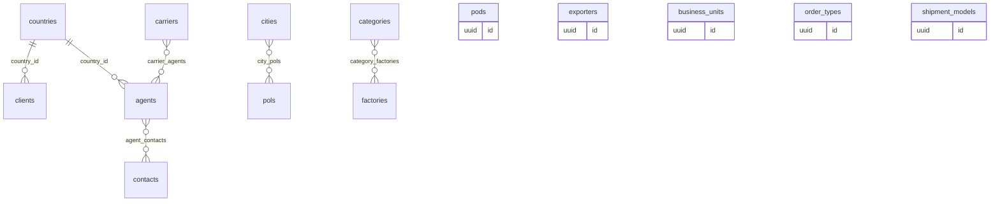
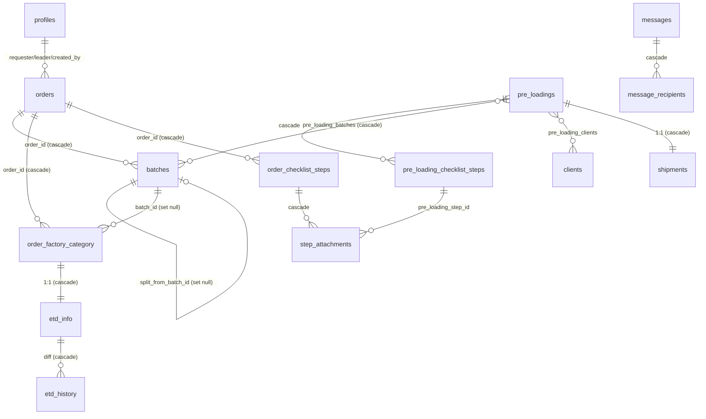

# Schema do banco — SOTWISE / AGK

Retrato do banco **de produção**, para servir de referência interna e de contrato
com o banco externo (**GSS**) que passa a ser responsável pelas bibliotecas.

- **Origem deste documento:** schema *live* do projeto Supabase **AGK**
  (`qqbeoljgpfllhcvqrsup`, Postgres 17, região `sa-east-1`), lido via OpenAPI do
  PostgREST em **2026-08-11**. Não é uma transcrição das migrations — onde os dois
  divergem, o que está aqui é o que existe no banco (ver §7).
- **Fonte de verdade das regras de negócio:** [`docs/regras_de_negocio.md`](regras_de_negocio.md).
- **Contrato da API REST das bibliotecas:** [`docs/API.md`](API.md).
- **35 tabelas** (37 com a migration `20260811130000` de features, ainda não
  aplicada — §7), 8 enums, schema `public`. RLS habilitado em modo *deny-all*:
  todo acesso é server-side com `service_role` atrás da DAL (`lib/dal.ts`).

---

## 1. Convenções

| Convenção | Regra |
|---|---|
| **PK** | `id uuid primary key default gen_random_uuid()`. Exceções: `profiles.id` (= `auth.users.id`) e as 6 tabelas de junção (PK composta). |
| **Timestamps** | `created_at` / `updated_at timestamptz not null default now()`. `updated_at` é mantido por trigger `set_updated_at()` em toda tabela que a tem. |
| **Autoria** | `created_by uuid references profiles(id)` — nullable. `null` = criado por serviço (token de API) ou pela migração do Bubble. |
| **Soft delete** | `deleted_at timestamptz` nas **bibliotecas** (e em `orders`/`pre_loadings`/`shipments`, onde é resíduo — ver abaixo). Toda leitura filtra `deleted_at is null`. |
| **Hard delete** | Orders / Pre-loadings / Shipments são apagados **de verdade** (decisão da migration `20260805130000`); as colunas `deleted_at` desses três seguem no schema mas não são mais o caminho de exclusão. |
| **Chave de origem** | `bubble_id text unique` (nullable) em 25 tabelas — id original no Bubble, usado no upsert idempotente da migração. Múltiplos `null` são permitidos porque a constraint é `unique` simples, não parcial. |
| **Enums** | Tipos Postgres nomeados (não `text` + check). Adicionar valor exige `alter type ... add value` em migration isolada. |
| **Idioma** | Identificadores em inglês; UI em inglês; documentação em PT-BR. |

---

## 2. Enums

| Enum | Valores (na ordem do tipo) |
|---|---|
| `company_type` | `BR`, `China` |
| `user_status` | `active`, `blocked` |
| `agent_location` | `brazil`, `china` |
| `order_status` | `in_negotiation`, `in_production`, `partially_preloading`, `pre_loading`, `partially_shipped`, `shipped`, `partially_delivered`, `delivered`, `canceled` |
| `batch_status` | `in_negotiation`, `in_production`, `preloading`, `in_transit`, `delivered`, `canceled` |
| `loading_status` | `total`, `partial`, `none` |
| `checklist_phase` | `order`, `preloading`, `shipment` — declarado, **não usado** por nenhuma coluna |
| `checklist_step` | 24 valores, na ordem da esteira: `order`, `po`, `pi`, `deposit_payment`, `packing_confirm`, `condition_confirm`, `place_the_order`, `etd`, `balance_payment`, `pre_loading`, `consolidation_point`, `city`, `port_of_loading`, `shipping_docs`, `agents`, `booking`, `loading_date`, `shipping_date`, `bl`, `original_docs`, `inspection_report`, `eta_brazil`, `ata_brazil`, `delivered` |
| `message_entity` | `order`, `pre_loading`, `shipment` |

A ordem do `order_status` é a ordem do fluxo — `order by status` e comparações
`<`/`>` seguem a esteira.

---

## 3. Mapa de relações

### 3.1 Bibliotecas (camada de referência — 14 tabelas + 4 junções)

`pods`, `exporters`, `business_units`, `order_types` e `shipment_models` são
ilhas: só nome (+ ícone/cor/sigla) e nenhuma FK entre bibliotecas.

### 3.2 Transacional

O **nível atômico de controle** do negócio é `order_factory_category`
(Order × Category × Factory): é nela que penduram o lote, a data de embarque e o
`loading_status`. `etd_info` é 1:1 com ela.

### 3.3 Quem aponta para as bibliotecas

Toda FK que sai do transacional para a camada de referência — é exatamente esta a
superfície que a interligação com o GSS precisa preservar:

| Biblioteca | Referenciada por |
|---|---|
| `countries` | `clients.country_id`, `agents.country_id` |
| `cities` | `city_pols.city_id`, `pre_loading_checklist_steps.city_id` |
| `pols` | `city_pols.pol_id`, `pre_loading_checklist_steps.pol_id` |
| `pods` | `pre_loadings.pod_id` |
| `factories` | `category_factories.factory_id`, `order_factory_category.factory_id`, `etd_info.dispatch_location_id`, `pre_loading_checklist_steps.consolidation_point_id`, `step_attachments.factory_id` |
| `categories` | `category_factories.category_id`, `order_factory_category.category_id` |
| `contacts` | `agent_contacts.contact_id`, `pre_loading_checklist_steps.contact_brazil_id`, `…contact_china_id` |
| `agents` | `agent_contacts.agent_id`, `carrier_agents.agent_id`, `pre_loading_checklist_steps.carrier_agent_id`, `…agent_brazil_id`, `…agent_china_id` |
| `carriers` | `carrier_agents.carrier_id`, `shipments.carrier_id` |
| `clients` | `orders.client_id`, `pre_loading_clients.client_id` |
| `exporters` | `orders.exporter_id` |
| `business_units` | `orders.business_unit_id` |
| `order_types` | `orders.order_type_id` |
| `shipment_models` | `shipments.shipment_model_id` |

---

## 4. Bibliotecas (Registration) — 14 tabelas

Contagens de produção em 2026-08-11. Todas têm `deleted_at`, `created_at`,
`updated_at`, `bubble_id`; a coluna `created_by` existe em todas **menos**
`countries`, `cities`, `pols` e `pods`.

| Tabela | Linhas | Colunas próprias (além das comuns) |
|---|---:|---|
| `countries` | 3 | `name` NOT NULL |
| `cities` | 51 | `name` NOT NULL |
| `pols` | 74 | `name` NOT NULL |
| `pods` | 26 | `name` NOT NULL |
| `factories` | 752 | `name` NOT NULL |
| `categories` | 115 | `name` NOT NULL |
| `carriers` | 26 | `name` NOT NULL |
| `shipment_models` | 6 | `name` NOT NULL |
| `clients` | 115 | `name` NOT NULL, `country_id` → `countries` (nullable) |
| `exporters` | 4 | `name` NOT NULL, `acronym` NOT NULL |
| `business_units` | 7 | `name` NOT NULL, `icon_path` (nullable — path no bucket `business-units`) |
| `order_types` | 5 | `name` NOT NULL, `icon_path` (nullable), `color` (nullable) |
| `contacts` | 288 | `name` NOT NULL, `email`, `email_na` NOT NULL default `false`, `phone_number` NOT NULL |
| `agents` | 144 | `name` NOT NULL, `country_id` → `countries`, `location` (`agent_location`), `email`, `email_na` NOT NULL, `phone_number` |

Regras que **não** estão no schema e vivem na aplicação:

- **E-mail “N/A”** (`contacts`, `agents`): ou `email` está preenchido, ou
  `email_na = true`. Nada garante isso no banco.
- **`agents.location`** é a base dos filtros “Agent Brazil / Agent China” do
  checklist. Foi derivada do `Country` do Bubble no backfill; um agente sem
  `location` desaparece desses dropdowns.
- **`categories` exige ≥ 1 fábrica** vinculada (validação de formulário).
- **Ícones** (`business_units.icon_path`, `order_types.icon_path`) são paths no
  Supabase Storage, não URLs nem binários — o arquivo não viaja pela API.

### Junções entre bibliotecas

| Tabela | PK | Semântica |
|---|---|---|
| `city_pols` | (`city_id`, `pol_id`) | Cidade agrupa POLs — modelada M-N, **cardinalidade real a validar no merge** |
| `category_factories` | (`category_id`, `factory_id`) | Categoria × Fábrica — M-N, **idem** |
| `agent_contacts` | (`agent_id`, `contact_id`) | Contatos do agente |
| `carrier_agents` | (`carrier_id`, `agent_id`) | Base do filtro “Carrier agent” no Pre-loading |

Todas com `on delete cascade` nas duas pontas e **sem** `id`, `bubble_id` ou
timestamps — são vínculos puros. Consequência para o sync: **junção não tem id
próprio para parear**; ela se sincroniza como conjunto (apaga e regrava), como já
faz `syncAgentContacts` na API.

---

## 5. Núcleo transacional

### 5.1 Auth / RBAC

**`roles`** (`admin`, `user` em prod; **`owner`** entra com a migration
`20260811130000`, ainda não aplicada — §7) — `id`, `name` NOT NULL unique, timestamps.

**`role_features`** / **`user_features`** — RBAC por *feature* (migration
`20260811130000`, **ainda não aplicada em prod** — §7). O catálogo de features
vive em código (`domain/access/features.ts`); estas tabelas guardam só a
**concessão**. Ambas RLS deny-all.

| Coluna | Tipo | Notas |
|---|---|---|
| `role_id` / `user_id` | uuid NOT NULL | → `roles` / `profiles`, `on delete cascade` |
| `feature_key` | text NOT NULL | chave do catálogo; linha órfã (key removida) é ignorada na resolução |
| `can_view` / `can_create` / `can_edit` / `can_delete` | boolean | `role_features`: NOT NULL default false. `user_features`: **nullable** (`null` = herda do papel; `true`/`false` sobrepõe nos dois sentidos) |
| PK | — | `role_features` = (`role_id`, `feature_key`); `user_features` = (`user_id`, `feature_key`) |

Resolução (`lib/dal.ts` + `resolvePermissions` em `domain/access/features.ts`):
`owner` → tudo (bypass em **código**, nunca em dado) → `user_features` sobrepõe →
`role_features` → `false` (fail closed).

**`profiles`** (56) — espelho de `auth.users`:

| Coluna | Tipo | Notas |
|---|---|---|
| `id` | uuid PK | = `auth.users.id`, `on delete cascade` |
| `full_name` | text NOT NULL | |
| `date_of_birth` | date | |
| `role_id` | uuid NOT NULL | → `roles` |
| `company` | `company_type` NOT NULL | `BR` \| `China` — segregação de dados por company **ainda não decidida** |
| `status` | `user_status` NOT NULL | `blocked` derruba a sessão a cada request (checado na DAL) |
| `hidden` | boolean NOT NULL | oculta de listagens, não bloqueia login |
| `slug` | text unique | |
| `ui_preferences` | jsonb NOT NULL | namespace de colunas: visibilidade por lista (`orders`, `etd-factories`, `pre-loading`). Namespace `views`: preferências de visualização do checklist (only my steps / hide completed / hide disabled) — `lib/view-prefs.ts` |
| `bubble_id` | text | |

**`activity_logs`** — `user_id` → `profiles` NOT NULL, `action` NOT NULL,
`entity_type`, `entity_id`, `metadata` jsonb, `created_at`. Índice
(`user_id`, `created_at desc`).

### 5.2 Orders

**`orders`** (1.575)

| Coluna | Tipo | Notas |
|---|---|---|
| `po_number` | text NOT NULL unique | auto-gerado, não editável |
| `order_type_id` | uuid | → `order_types` |
| `schedule_requested` | date | |
| `asap` | boolean NOT NULL | |
| `client_id` | uuid | → `clients` |
| `client_reference` | text | |
| `business_unit_id` | uuid | → `business_units` |
| `requester_id`, `leader_id`, `created_by` | uuid | → `profiles` |
| `exporter_id` | uuid | → `exporters` |
| `status` | `order_status` NOT NULL | **rollup dos lotes** — recalculado na aplicação (`lib/order-status.ts`), não há trigger |
| `date_po` | date | |
| `deleted_at` | timestamptz | resíduo — exclusão é hard |

**`batches`** (3.144) — `order_id` NOT NULL (cascade), `batch_number` NOT NULL
(`.NN` sequencial, unique por order), `status` (`batch_status`),
`split_from_batch_id` (auto-FK, `set null` — linhagem do split).

**`order_factory_category`** (9.495) — `order_id` NOT NULL (cascade),
`category_id` NOT NULL, `factory_id` NOT NULL, `batch_id` (nullable, `set null`
— **muda de lote no split**), `ship_requirement` date (nullable desde o
reconcile), `loading_status` (`loading_status`, atribuído ao confirmar embarque).

**`etd_info`** — 1:1 com `order_factory_category` (`unique`, cascade):
`remarks`, `ready` + `ready_date`, `inspection`, `dispatch_location_id` →
`factories`, `initial_date`, `dispatch_date`, `"current_date"` (nome entre aspas
— palavra reservada).

**`etd_history`** — `etd_info_id` NOT NULL (cascade), `changed_fields` jsonb
NOT NULL (diff `{campo: {from, to}}`), `changed_by`, `changed_at`.

**`order_checklist_steps`** — `order_id` NOT NULL (cascade), `step`
(`checklist_step`), unique (`order_id`, `step`); `enabled` (toggle das etapas
opcionais), `done` (derivado de `completed_on`), `estimated_date`,
`responsible_id`, `completed_on`, `signed_by_id`.

**`step_attachments`** — path de arquivo no bucket `order-documents`. Aponta para
**uma das duas** origens: `checklist_step_id` → `order_checklist_steps` ou
`pre_loading_step_id` → `pre_loading_checklist_steps` (ambas nullable, sem check
de exclusividade), mais `factory_id` opcional e `uploaded_by`.

### 5.3 Pre-loading

**`pre_loadings`** (1.389) — `pl_number` NOT NULL unique (`PL - NNNN`),
`created_date`, `client_reference`, `pod_id` → `pods`, `responsible_signer_id`,
`leader_id`, `booking_status` (texto livre), `seal_number`,
`shipping_confirmed_at` (preenchido → sai da lista de PLs), `created_by`.
`client_reference`, `pod_id` e `leader_id` são nullable por causa do import.

**`pre_loading_clients`** (`pre_loading_id`, `client_id`) e
**`pre_loading_batches`** (`pre_loading_id`, `batch_id`) — junções; a segunda tem
`on delete cascade` nas duas pontas (viabiliza o hard delete de Order).

**`pre_loading_checklist_steps`** — checklist **único e contínuo** das etapas
#11–24 (Pre-loading + Shipment na mesma tabela), unique (`pre_loading_id`,
`step`). Campos genéricos (`done`, `estimated_date`, `responsible_id`,
`completed_on`, `signed_by_id`, `notes`) + campos específicos de etapa, todos
apontando para bibliotecas: `consolidation_point_id` → `factories`, `city_id` →
`cities`, `pol_id` → `pols`, `carrier_agent_id` / `agent_brazil_id` /
`agent_china_id` → `agents`, `contact_brazil_id` / `contact_china_id` →
`contacts`, `booking_number`.

### 5.4 Shipments

**`shipments`** (1.339) — `pre_loading_id` NOT NULL unique (1:1, cascade),
`shipment_model_id` → `shipment_models`, `carrier_id` → `carriers`,
`container_number`, `status` **text** (`in_transit` \| `delivered` \| `canceled`
— único status do sistema que não é enum), `leader_id`, `signer_id`,
`estimated_date`, `created_by`.

### 5.5 Mensagens

**`messages`** — `entity_type` (`message_entity`) + `entity_id` (**FK polimórfica
sem constraint**: aponta para `orders`, `pre_loadings` ou `shipments`),
`author_id` NOT NULL, `body` NOT NULL (check 1–500 chars). Sem exclusão.

**`message_recipients`** — (`message_id`, `user_id`) PK, `read_at`. Índice
parcial de não-lidas. Regra: dentro da tela do registro todos veem a thread
inteira; fora dela, só quem foi marcado no “Forward to”.

**Entrega instantânea (Realtime).** Depois de gravar a mensagem *e* os
destinatários, o servidor publica um aviso no tópico de broadcast
`sotwise:messages` (POST em `/realtime/v1/api/broadcast` com a `service_role`).
O aviso leva só ids — nunca o corpo da mensagem — e quem está com o balão ou a
caixa aberta recarrega na hora. O canal é **privado**: quem autoriza a entrada é
a policy de `select` em `realtime.messages` criada pela migration
`20260813130000_messages_realtime.sql`, **que precisa ser aplicada no banco** —
sem ela ninguém entra no canal e o app cai no polling. Publicar é exclusividade
do servidor (nenhuma policy de `insert` foi concedida a `authenticated`).

---

## 6. Camada de interligação com o banco externo (GSS)

O que **já existe** no repo para isso:

1. **API REST das bibliotecas** (`app/api/[resource]`, registry em
   `domain/api/registry.ts`, contrato em [`docs/API.md`](API.md)): 14 recursos,
   `GET` (listar, `q`/`limit`/`offset`) e `POST` (criar 1 registro),
   `Authorization: Bearer <API_TOKEN>`. Ativa em produção.
2. **Migration `20260803120000_add_gss_id_to_libraries.sql`**: adiciona
   `gss_id text unique` nas 14 bibliotecas, mesmo padrão do `bubble_id`, para
   `on conflict (gss_id)` → upsert idempotente. **Escrita, mas ainda NÃO
   aplicada em produção** (verificado em 2026-08-11: `column countries.gss_id
   does not exist`).

Colunas reaproveitáveis pelo sync, já presentes: `updated_at` (detecção de
mudança / last-write-wins) e `deleted_at` (soft delete propagável).

### 6.1 Lacunas conhecidas da superfície atual

Levantadas ao documentar a API — todas precisam ser resolvidas antes de qualquer
sincronização valer:

| Lacuna | Impacto |
|---|---|
| API só tem `GET` e `POST` | Sem `PATCH`/`DELETE`, uma alteração ou exclusão feita no GSS não tem como chegar aqui. |
| `gss_id` não é aceito nem devolvido pela API | `POST {"name":"X","gss_id":"G1"}` cria o registro **sem** o `gss_id`, e responde `201` sem avisar. Não existe pareamento por id externo hoje. |
| Sem upsert / sem idempotência | Repetir o mesmo `POST` duplica o registro; nenhum campo exposto é unique, então não há `409` de proteção. |
| `GET` sem filtro por data | Não há `updated_since` — só varredura completa, sem sync incremental. |
| `GET` sem total | Paginação só por “recebi menos que o `limit`”. |
| `POST /api/agents` falha parcial | `contact_ids` é gravado em segunda etapa sem rollback: id inválido → `500` **com o agente já criado**. |
| Junções sem endpoint próprio | `city_pols`, `category_factories`, `carrier_agents` não são expostas (só `agent_contacts`, indiretamente, via `POST /api/agents`). |
| Ícones fora da API | `business_units` e `order_types` nascem sem ícone; upload só pela tela. |
| Sem contador de linhas nem `if-match` | Não há como detectar conflito de escrita concorrente. |

### 6.2 O que precisa ser acordado com o dono do GSS

Para cada uma das 14 bibliotecas:

- **Id estável** no GSS (o valor que vai para `gss_id`) — imutável, único, e que
  não se perca quando o registro é editado lá.
- **Nome canônico** e política de deduplicação. A base local tem 752 fábricas e
  288 contatos vindos do Bubble, com duplicatas prováveis: o merge inicial é um
  pareamento por nome normalizado, com resolução manual do resto.
- **Timestamp de modificação** e **marca de exclusão** do lado do GSS.
- **Campos além do nome**, onde existem: `clients.country_id` (FK entre
  bibliotecas), `agents` (`country_id`, `location` `brazil`/`china`, e-mail,
  telefone, contatos vinculados), `contacts` (e-mail/N-A, telefone),
  `exporters.acronym`, `order_types` (`color`, ícone), `business_units` (ícone).
- **Cardinalidade real** de Cidade×POL e Categoria×Fábrica — hoje modeladas M-N
  por leitura da tela; se no GSS for 1-N, o schema local muda.

### 6.3 Invariante que a interligação não pode quebrar

As bibliotecas **não são folhas isoladas**: 25 FKs do núcleo transacional
apontam para elas (§3.3), sobre 9.495 linhas de `order_factory_category`, 3.144
lotes e 1.389 pre-loadings. Portanto:

- Os `uuid` locais das bibliotecas são **imutáveis**. O pareamento com o GSS é
  por `gss_id`; trocar a PK local para o id do GSS quebraria todas essas FKs.
- Exclusão vinda do GSS **não pode virar `delete`** — só `deleted_at`. Um
  `factories` apagado de verdade derrubaria linhas de `order_factory_category`
  (ou seria bloqueado pela FK, que não tem `on delete`).
- Toda escrita continua passando pelo `service_role` server-side (RLS deny-all).
  O GSS nunca fala com o Postgres direto.

---

## 7. Divergências repo ↔ produção (pendências)

| Item | Estado |
|---|---|
| `gss_id` nas 14 bibliotecas | Migration `20260803120000` **não aplicada** em prod. |
| `role_features`, `user_features`, papel `owner` | Migration `20260811130000` (RBAC por feature) **escrita, não aplicada** em prod. As queries em `lib/dal.ts` já leem essas tabelas — **aplicar ANTES do deploy**, senão toda página protegida quebra. Depois, promover ao menos 1 usuário a `owner` (a tela `/access` é owner-only). |
| `role_permissions`, `role_step_denies` | Modeladas no MD, **nunca criadas** — o RBAC por feature (acima) usa `role_features`/`user_features` no lugar. |
| `etd_factories_view`, `todo_list_view` | Previstas no MD, **não existem** — as telas montam a consulta na aplicação. |
| `checklist_phase` | Enum criado, nenhuma coluna usa. |
| `orders.status` | Prod tem 9 valores (ganhou `partially_preloading` e `pre_loading` na migration `20260805120000`); o `init_schema` tem 7. |
| NOT NULLs relaxados para o import | `clients.country_id`, `order_types.color`/`icon_path`, `business_units.icon_path`, `order_factory_category.ship_requirement`, `pre_loadings.client_reference`/`pod_id`/`leader_id`. Podem voltar a NOT NULL numa limpeza. |
| `deleted_at` em `orders`/`pre_loadings`/`shipments` | Resíduo do soft delete; exclusão hoje é hard. |
| `shipments.status` | `text` com default, não enum. |
| `messages.entity_id` | Polimórfico, sem FK — integridade só na aplicação. |
| Uploads do Bubble → Storage, `etd_history`, RLS policies | Pendências pós-migração (MD §12.8). |
